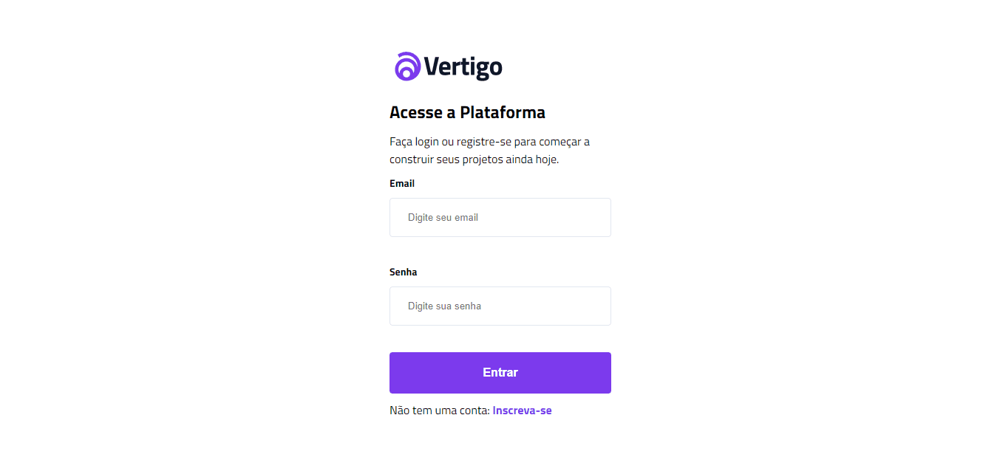

# 🖥️ Projeto Tela de Login

## ⌨ Descrição

Projeto realizado com o objetivo de criar uma tela de login com validação nos campos de email e senha usando o javaScript.

## ✍️ Processo

- Marcação semântica HTML5
- Propriedades personalizadas de CSS3
- JavaScript
- Flexbox
- Design responsivo

### ✅ Validações

- A borda do input ficará verde quando estiver tudo correto;
- Quando o email e/ou senha não estiverem escrito no formato correto, aparecerá uma mensagem de erro e a borda do input ficará vermelho;
- Quando o input de email e/ou senha estiverem vazios, aparecerá uma mensagem de erro para que sejam preenchidos.

## 🖱️ A página

    
> <a href="https://devkarine.github.io/tela-de-login/" target= "_blank">Acesse a página online</a>

## 👩‍💻 Dev

<table align="center">
  <tr>
    <td align="center">
      

         
          <b> Karine Pereira </b> 
            
            
      

    </td>

  </tr>
</table>
